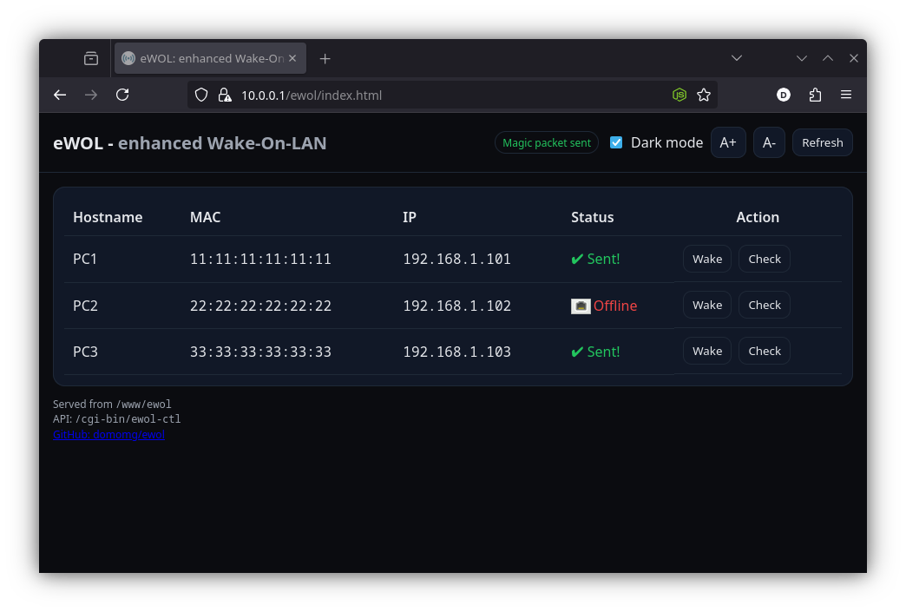

# eWOL - enhanced Wake-on-LAN UI for OpenWRT / GL.iNet devices

**Inspired by [this OpenWrt forum post](https://forum.openwrt.org/t/pwol-public-wake-on-lan-interface-example/175726/2) and refined into a single-shot installer script.**

eWOL is a clean, practical, and user-friendly web UI for waking up and checking the status of devices on your LAN, through your OpenWrt router and a bit of Lua magic. 
This project is designed for anyone who wants a hassle-free Wake-On-LAN tool with zero dependencies beyond standard OpenWrt packages.

No containers, no binaries, just simple HTML + JS + Lua + etherwake



---

## Features

- **One-step install:** Just run the shell script on your router.
- **Nice, responsive UI:** Dark/light theme, font size zoom buttons.
- **Device status:** Wake devices, check if they're online, see clear status icons.
- **Modern UX:** Remembers your theme and font zoom preferences, no page reloads.
- **Secure by default:** Only accessible from LAN unless you intentionally enable WAN access.
- **Self-contained:** All files in `/www/ewol`, with a single CGI endpoint `/cgi-bin/ewol-ctl`.

---

## Quick Start

1. **SSH login as root on your OpenWRT router, then grab the install script:**

    ```sh
    wget -O ./ewol-install.sh https://raw.githubusercontent.com/domomg/eWOL/refs/heads/main/ewol-install.sh
    sh ./ewol-install.sh
    ```

2. **Edit `/www/pwol/devices.json` to add your devices:**

  ```json
  {
    "PC1": {
      "mac": "11:11:11:11:11:11",
      "ip": "192.168.1.101"
    },
    "PC2": {
      "mac": "22:22:22:22:22:22",
      "ip": "192.168.1.102"
    },
    "PC3": {
      "mac": "33:33:33:33:33:33",
      "ip": "192.168.1.103"
    }
  }
  ```

3. **Install etherwake if missing:**

    ```sh
    opkg update && opkg install etherwake
    ```

4. **Browse to [http://YOUR_ROUTER_IP/ewol/index.html](http://YOUR_ROUTER_IP/ewol/index.html)**

---

## What files are created after the installation:

- **Frontend:**  
  - `/www/ewol/index.html` — The UI (uses `/ewol/style.css` and `/ewol/script.js`)
  - `/www/ewol/style.css` — All styles (dark/light themes, font zoom, icons)
  - `/www/ewol/script.js` — All logic (table, buttons, live status, settings)
- **Backend:**  
  - `/www/ewol/api.lua` — Fast Lua CGI for Wake-on-LAN and ping (uses LuCI libraries)
  - `/www/ewol/devices.json` — List of your devices (hostname, MAC, IP)
  - `/cgi-bin/ewol-ctl` — Symlink to the Lua API

- **Icons:**  
  - Uses OpenWrt's standard LuCI status icons (e.g. `/luci-static/resources/icons/port_up.png` for "Online")

---

## How to remove it:

```sh
rm -rf /www/ewol/
rm /www/cgi-bin/ewol-ctl
```

---

## Settings and Customization

- **Theme:**  
  - Click the “Dark mode” toggle — your choice is remembered locally.
- **Font size:**  
  - Use A+ / A- buttons to zoom text — preference is remembered.
- **Device list:**  
  - Edit `/www/ewol/devices.json` in-place. Format is simple JSON.
- **LAN only by default:**  
  - To allow public/WAN access, set `ALLOW_PUBLIC=1` in `/www/ewol/api.lua`.

---

## FAQ

- **Q: Why does Wake just show a green check, not a status?**  
  A: Wake-on-LAN is "fire and forget". The UI shows "Sent!" (✔) to confirm the packet was sent, but only "Check" button actually pings the device.

- **Q: Can I use this outside my LAN?**  
  A: By default, WAN is blocked. If you know what you're doing, set `ALLOW_PUBLIC=1` (see above), but **be careful**, there's no auth implemented.

- **Q: Does this work on any OpenWrt device?**  
  A: Yes! As long as you have LuCI (for Lua and icons), etherwake, and standard ping.

---

## Credits

- **Original inspiration:**  
  [OpenWrt Forum: PWOL Public Wake-On-LAN interface example](https://forum.openwrt.org/t/pwol-public-wake-on-lan-interface-example/175726/2)
- **This project:**  
  Refined and extended for real-world use. Delivered as a single, friendly install script.

---

## License

MIT — free as in freedom.
